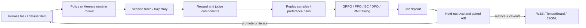

<div align="center">

# hermes-agentic-rl

**Hermes-native reinforcement learning for agent behavior, tool use, and
session-driven improvement.**

[English](README.md) | [简体中文](README.zh-CN.md)


</div>

`hermes-agentic-rl` turns Hermes-agent session experience into a measurable
training loop: collect trajectories, judge behavior, build replay data, update
trainable policies or reward models, and verify improvements on held-out
benchmarks.

> This repository is the learning layer around Hermes-agent. It is built for
> Hermes-native agentic RL, not as a generic chat-model fine-tuning wrapper.

## Contents

- [Project Snapshot](#project-snapshot)
- [Recommended Paths](#recommended-paths)
- [Why This Exists](#why-this-exists)
- [Trainable Surfaces](#trainable-surfaces)
- [Closed Loop](#closed-loop)
- [Where We Improve Next](#where-we-improve-next)
- [Capabilities](#capabilities)
- [Quick Start](#quick-start)
- [External Subprojects](#external-subprojects)
- [Secrets and Environment](#secrets-and-environment)
- [Training Modes](#training-modes)
- [Key Configurations](#key-configurations)
- [CLI Reference](#cli-reference)
- [Architecture](#architecture)
- [Verification](#verification)
- [Docs](#docs)

## Project Snapshot

| Dimension | What this project provides |
|---|---|
| Agent focus | Tool use, terminal-command actions, multi-turn recovery, protocol adherence |
| Training paths | `train-rl` for GRPO/PPO, `online-cycle` for Hermes replay plus worker training |
| Trainable surfaces | Tiny/HF policy backends, PPO value heads, LoRA adapters, reward-model heads, BC/DPO workers |
| Data sources | Hugging Face traces, local parquet shards, real Hermes session logs, replay JSONL |
| Evaluation | Held-out grouped trace benchmarks, checkpoint ranking, paired A/B comparisons |
| Observability | W&B, TensorBoard, JSONL metrics, live dashboard, structured reward components |

## Recommended Paths

| If you want to... | Start here |
|---|---|
| Check repo and Hermes subproject wiring | `python -m hermes_agentic_rl.cli.main hermes-preflight` |
| Check Atropos and Tinker-Atropos wiring | `python -m hermes_agentic_rl.cli.main atropos-preflight` |
| Train a small on-policy policy quickly | `configs/hermes_reasoning_traces_grpo_smoke.yaml` |
| Train on a local parquet shard with MPS | `configs/hermes_reasoning_traces_parquet_mps_filtered.yaml` |
| Verify whether RL improved behavior | `configs/hermes_reasoning_traces_eval_rl.yaml` |
| Batch self-evolution validation by direction | `configs/self_evolution_batch.yaml` |
| Run Hermes, replay, worker training, and export in one loop | `configs/hermes_online_cycle.yaml` |

## Why This Exists

`hermes-agent` is the execution layer: it runs tasks, calls tools, interacts
with runtimes, and leaves behind session traces. `hermes-agentic-rl` is the
learning layer around it: it turns those traces into rollouts, rewards, replay
buffers, preference pairs, reward-model data, checkpoints, and held-out
benchmarks.

The goal is not to make an agent "smarter" in the abstract. The goal is to
improve the agent's behavior distribution on concrete Hermes-style tasks:

- choosing when to answer directly and when to call a tool;
- emitting valid tool-call and terminal-command formats;
- using tool results across multiple turns instead of drifting;
- preferring trajectories that complete the task under a measurable reward;
- preserving evidence through W&B, JSONL metrics, TensorBoard, checkpoints,
  and held-out eval instead of trusting training reward alone.

For agent self-evolution, each run is treated as a controlled improvement
experiment: choose an optimization direction, collect comparable trajectories,
train the relevant surface, and promote changes only when held-out metrics
support the move.

Hermes-agent is the actor. `hermes-agentic-rl` is the feedback loop that makes
that actor more reliable, controllable, and auditable. When the backend is
local, HF-backed, Tiny, LoRA-adapted, or equipped with a reward model, this
framework updates trainable parameters. When Hermes uses a remote
OpenAI-compatible model, the framework can still collect traces, evaluate
behavior, train local workers or reward models, and export self-evolution
data, but it will not change remote weights unless the provider exposes a
training path.

## Trainable Surfaces

The framework updates trainable components inside or around the policy stack:

- the policy backend itself, such as `TinyCausalLMBackend` or
  `HFCausalLMBackend`;
- a PPO value head when `with_value_head=True`;
- LoRA adapter parameters when LoRA is injected;
- a reward-model head during preference or RM training;
- BC/DPO worker weights in the online replay loop.

That means `train-rl` can improve a local or HF-backed policy, and
`online-cycle` can improve local worker models and reward models.

## Closed Loop



## Where We Improve Next

The next gains should stay benchmark-first:

- strengthen held-out benchmarks for tool-call validity, command correctness,
  task success, and paired A/B checkpoint comparisons;
- move from tiny validation runs to LoRA or HF-backed trainable policies so RL can
  affect a model with enough capacity to learn valid Hermes actions;
- improve reward shaping for executable tool calls, especially JSON validity,
  tool-name matching, argument-value similarity, stop behavior, and multi-turn
  credit assignment;
- continue dataset filtering and curriculum design so early training targets
  are short, executable, and aligned with the model's action space;
- scale runtime performance with batched rollout/scoring, MPS/GPU profiling,
  and optional distributed workers after reward and eval signals are stable.

Recent checkpoint sweeps, W&B links, and caveats live in
[Experiment Notes](docs/experiments.md) so this README can stay focused on
stable entry points.

## Capabilities

| Area | Entry point | Status |
|---|---|---|
| Real Hermes runtime | `runtime.integration: hermes` | Loads from `runtime.repo_path`, `HERMES_AGENT_REPO`, or `subprojects/hermes-agent`. |
| Local RL validation run | `train-rl` | CPU-friendly Tiny backend with GRPO/PPO and W&B/TensorBoard metrics. |
| Real dataset RL | `configs/hermes_reasoning_traces_grpo.yaml` | Uses `lambda/hermes-agent-reasoning-traces`; the smoke config is only for quick validation. |
| Held-out RL benchmark | `eval-rl` | Baseline vs checkpoint on grouped held-out traces with structured metrics. |
| Online Hermes RL cycle | `configs/hermes_online_cycle.yaml` | Rollout -> sidecar replay -> BC worker -> self-evolution export. |
| Directional self-evolution | `self-evolution-batch` | Batch replay, worker training, validation splits, and per-direction summaries. |
| Self-evolution export | `session-eval-export` | Writes `task_input` / `expected_behavior` JSONL splits. |
| Observability | `metrics:` | JSONL, stdout, TensorBoard, W&B, and optional live dashboard. |
| External subprojects | `subprojects/*` | Upstream checkouts for Hermes-agent, Atropos, and Tinker-Atropos. |

## Quick Start

```bash
python -m pip install -e '.[rl,data,metrics]'
git submodule update --init subprojects/hermes-agent subprojects/atropos subprojects/tinker-atropos
python -m hermes_agentic_rl.cli.main hermes-preflight
```

Expected preflight shape:

```json
{
  "repo_source": "subproject",
  "missing": []
}
```

`hermes-agent` is expected at `subprojects/hermes-agent` by default. Override
that path when needed:

```bash
export HERMES_AGENT_REPO=/path/to/hermes-agent
```

## External Subprojects

External repositories are managed as git submodules under `subprojects/`, not
vendored as first-party source at the repository root.

| Path | Upstream | Used for |
|---|---|---|
| `subprojects/hermes-agent` | `NousResearch/hermes-agent` | Real Hermes runtime and session replay integration. |
| `subprojects/atropos` | `NousResearch/atropos` | Optional Atropos environment adapters and compatibility tests. |
| `subprojects/tinker-atropos` | `NousResearch/tinker-atropos` | Optional Tinker-Atropos preflight and trainer integration checks. |

After cloning or switching branches, run:

```bash
git submodule update --init subprojects/hermes-agent subprojects/atropos subprojects/tinker-atropos
python -m hermes_agentic_rl.cli.main hermes-preflight
python -m hermes_agentic_rl.cli.main atropos-preflight
```

The framework code treats these as external projects. CI initializes the
top-level submodules, while linting, typing, packaging, and docs gates focus on this
repository's adapters, trainers, rewards, configs, and tests.

## Secrets and Environment

Do not write API keys into YAML files. The Hermes adapter supports both a
single `runtime.api_key_env` and ordered `runtime.api_key_envs`.

For the OpenAI-compatible NewAPI endpoint used by the online cycle example:

```bash
export NEWAPI_API_KEY='...'
```

The example config also falls back to `LKEAP_API_KEY` and `OPENAI_API_KEY`.

For W&B:

```bash
wandb login
# or
export WANDB_API_KEY='...'
```

## Training Modes

### Real Dataset Training

This runs GRPO on the public Hermes reasoning trace dataset with the Tiny
backend. It is intentionally small enough for a CPU-friendly validation run
while still using real trace data.

```bash
python -m hermes_agentic_rl.cli.main train-rl \
  --config configs/hermes_reasoning_traces_grpo_smoke.yaml \
  --output outputs/hermes_reasoning_traces_real_smoke
```

Main outputs:

- `outputs/hermes_reasoning_traces_real_smoke/train_rl_summary.json`
- `outputs/hermes_reasoning_traces_real_smoke/metrics.jsonl`
- `outputs/hermes_reasoning_traces_real_smoke/tb/`
- `outputs/hermes_reasoning_traces_real_smoke/wandb/`

The config logs reward statistics, prompt/response token lengths, optimizer
step counts, reward component scores, and gradient/parameter norms.

### Local Parquet on MPS

For a local `lambda/hermes-agent-reasoning-traces` parquet shard, use the MPS
config. The loader reads parquet rows with `pyarrow`, expands each
conversation into assistant-turn supervised/RL samples, and restores the
`tools` JSON payload into tool schema data.

```bash
mkdir -p data/hermes_reasoning_traces
ln -sf /Users/gatilin/Downloads/train.parquet \
  data/hermes_reasoning_traces/train.parquet

export WANDB_API_KEY='...'
PYTORCH_ENABLE_MPS_FALLBACK=1 python -m hermes_agentic_rl.cli.main train-rl \
  --config configs/hermes_reasoning_traces_parquet_mps.yaml \
  --output outputs/hermes_reasoning_traces_parquet_mps_run
```

For a stronger next ablation, use the filtered config:

```bash
PYTORCH_ENABLE_MPS_FALLBACK=1 python -m hermes_agentic_rl.cli.main train-rl \
  --config configs/hermes_reasoning_traces_parquet_mps_filtered.yaml \
  --output outputs/hermes_reasoning_traces_parquet_mps_filtered_hybrid
```

For terminal-command curriculum training:

```bash
PYTORCH_ENABLE_MPS_FALLBACK=1 python -m hermes_agentic_rl.cli.main train-rl \
  --config configs/hermes_reasoning_traces_parquet_mps_terminal_command_stage2.yaml \
  --output outputs/hermes_reasoning_traces_parquet_mps_terminal_command_stage2
```

`assistant_response_adapter: terminal_command_tool_call` lets the policy emit
only a terminal command string. Reward and eval wrap that string back into a
Hermes-compatible terminal tool call, separating executable structure from
command-content learning.

### Held-Out Evaluation

To answer "did RL actually improve the model?", use a held-out benchmark pass
instead of training reward alone. The eval command keeps all turns from the
same `source_trace_id` in the same split, runs baseline and checkpoint
policies on the exact same items, and logs reward, success rate,
finished-naturally rate, and structured tool-call metadata.

```bash
python -m hermes_agentic_rl.cli.main eval-rl \
  --config configs/hermes_reasoning_traces_eval_rl.yaml
```

The recommended gate before promoting a checkpoint is to compare held-out
reward deltas, paired A/B results, `tool_call_parse_ok`, `tool_name_match`, and
argument-overlap metrics.

`eval-rl` writes `promotion.md` and `capability_report.md`. The capability
report groups raw metrics into Hermes-agent capabilities such as task success,
tool-use reliability, interaction control, and self-evolution signal, which is
more useful than a single reward when you decide what to optimize next. For
automation, use `eval-gate`; it returns exit code `3` when the promotion gate
recommends `hold`.

For the command-action stage:

```bash
python -m hermes_agentic_rl.cli.main eval-rl \
  --config configs/hermes_reasoning_traces_eval_rl_terminal_command_stage2.yaml
```

### Online Hermes Cycle

`online-cycle` is the end-to-end online path:

1. Run real Hermes on task prompts.
2. Write raw session traces and direction-aware replay samples with the session sidecar.
3. Train a local worker from replay, using `bc`, `dpo`, or `rm` worker configs.
4. Export the same traces as a self-evolution dataset.
5. Log worker metrics to JSONL and W&B.

```bash
export NEWAPI_API_KEY='...'

python -m hermes_agentic_rl.cli.main online-cycle \
  --config configs/hermes_online_cycle.yaml \
  --once \
  --limit 1
```

Main outputs:

- `outputs/hermes_online_cycle/sessions.jsonl`
- `outputs/hermes_online_cycle/replay.jsonl`
- `outputs/hermes_online_cycle/policy.pt`
- `outputs/hermes_online_cycle/worker_state.json`
- `outputs/hermes_online_cycle/worker_metrics.jsonl`
- `outputs/hermes_online_cycle/self_evolution_dataset/`

Replay records include `metadata.replay_mining`, which tags capability axes,
mining reasons, recommended uses, and Skill-candidate signals. The matching
quality report aggregates these tags so we can filter replay data by direction
instead of treating every session turn as the same kind of training signal.

### Self-Evolution Export

To convert existing Hermes session traces into evaluation/self-evolution data:

```bash
python -m hermes_agentic_rl.cli.main session-eval-export \
  --config configs/session_eval_export_hermes.yaml
```

Output shape:

- `train.jsonl`
- `val.jsonl`
- `holdout.jsonl`
- `manifest.json`

Each record contains `task_input`, `expected_behavior`, difficulty/category
metadata, reward when available, and source session identifiers.

### Batch Self-Evolution Validation

To optimize the agent in explicit directions, run the batch self-evolution
pipeline. It replays Hermes session traces, trains a local worker for each
direction, and exports a direction-specific self-evolution dataset.

```bash
python -m hermes_agentic_rl.cli.main self-evolution-batch \
  --config configs/self_evolution_batch.yaml
```

Main outputs:

- `outputs/hermes_self_evolution_batch/batch_summary.json`
- `outputs/hermes_self_evolution_batch/<direction>/replay.jsonl`
- `outputs/hermes_self_evolution_batch/<direction>/policy.pt`
- `outputs/hermes_self_evolution_batch/<direction>/worker_state.json`
- `outputs/hermes_self_evolution_batch/<direction>/self_evolution_dataset/`

Use this when you want to compare optimization directions such as tool-call
reliability, recovery behavior, or completion quality in one repeatable run.
The batch summary also reports `mined_replay_axes` and `skill_candidates`,
which are early signals for deciding whether the next loop should train
weights, mine more sessions, or export candidate Skills.

## Key Configurations

| Config | Purpose |
|---|---|
| `configs/hermes_reasoning_traces_grpo_smoke.yaml` | Real HF dataset GRPO validation run with W&B/TensorBoard metrics. |
| `configs/hermes_reasoning_traces_grpo.yaml` | Larger real dataset GRPO run. |
| `configs/hermes_reasoning_traces_parquet_mps.yaml` | Local parquet reasoning trace training on Apple MPS. |
| `configs/hermes_reasoning_traces_parquet_mps_filtered.yaml` | Filtered local parquet MPS run for shorter tool-call targets. |
| `configs/hermes_reasoning_traces_parquet_mps_terminal_curriculum.yaml` | Terminal-command curriculum stage with a fixed JSON scaffold. |
| `configs/hermes_reasoning_traces_parquet_mps_terminal_command_stage2.yaml` | Stage-2 terminal command action-space training on MPS. |
| `configs/hermes_reasoning_traces_eval_rl.yaml` | Held-out benchmark comparing baseline vs RL checkpoint on grouped traces. |
| `configs/hermes_reasoning_traces_eval_rl_terminal_command_stage2.yaml` | Held-out benchmark for stage-2 command-action checkpoints. |
| `configs/self_evolution_batch.yaml` | Batch directional self-evolution replay, worker training, and export. |
| `configs/hermes_online_cycle.yaml` | Real Hermes online rollout plus replay worker and self-evolution export. |
| `configs/hermes_runtime_sidecar.yaml` | Runtime sidecar example for session/replay capture. |
| `configs/session_train_worker.yaml` | BC worker over replay JSONL. |
| `configs/session_dpo_worker.yaml` | DPO worker over scored replay pairs. |
| `configs/session_rm_worker.yaml` | Reward-model worker over scored replay pairs. |

## CLI Reference

```bash
python -m hermes_agentic_rl.cli.main hermes-preflight
python -m hermes_agentic_rl.cli.main rollout --config <config> --output outputs/trajectory.json
python -m hermes_agentic_rl.cli.main train --config <config>
python -m hermes_agentic_rl.cli.main train-rl --config <config> --output <dir>
python -m hermes_agentic_rl.cli.main eval-rl --config <config>
python -m hermes_agentic_rl.cli.main self-evolution-batch --config <config>
python -m hermes_agentic_rl.cli.main online-cycle --config <config> --once --limit 1
python -m hermes_agentic_rl.cli.main session-replay --config <config>
python -m hermes_agentic_rl.cli.main session-train-worker --config <config> --once
python -m hermes_agentic_rl.cli.main session-eval-export --config <config>
```

## Architecture

```text
hermes_agentic_rl/
  runtime/       Hermes and fake runtime adapters
  framework/     EnvTrainingPipeline and SessionTrainingPipeline
  collectors/    Session sidecar, replay export, quality filters, replay mining
  envs/          Echo, simulated tool, curriculum, Hermes reasoning traces
  trainers/      GRPO/PPO on-policy trainers
  eval/          Held-out eval, leaderboard, paired A/B comparison
  offline/       BC, DPO, reward-model training
  rewards/       Outcome, tool-call, filesystem, feedback, RM components
  monitor/       JSONL, TensorBoard, W&B, dashboard writers
  cli/           Rollout, train, train-rl, eval-rl, eval-gate, self-evolution-batch, online-cycle, replay workers
```

Data flow:

```text
Hermes rollout
  -> session_sidecar
  -> sessions.jsonl + replay.jsonl
  -> session_train_worker
  -> policy / RM checkpoint
  -> session_eval_export
  -> self_evolution_dataset
```

## Verification

The repo treats linting, type checking, coverage, docs, and dependency audit as
part of the deliverable:

```bash
python -m ruff check hermes_agentic_rl tests scripts/check_real_hermes.py
python -m mypy --follow-imports=skip hermes_agentic_rl
python -m pytest tests -q --cov=hermes_agentic_rl --cov-report=term-missing --cov-report=xml
sphinx-build -W --keep-going -b html docs/sphinx docs/sphinx/_build/html
uv pip compile --universal pyproject.toml --extra dev --extra docs --output-file requirements-lock.txt
pip-audit -r requirements-lock.txt
```

GitHub Actions runs lint, coverage tests, docs build, and dependency audit on
Python 3.11 and 3.12. Live training/eval validation snapshots are in
[Experiment Notes](docs/experiments.md).

## Docs

- [Hermes-native training framework](docs/hermes-native-training-framework.md)
- [Experiment notes](docs/experiments.md)
- [Self-evolution export](docs/self-evolution-export.md)
- [Real Hermes check](docs/real-hermes-check.md)
- [Configuration reference](docs/configuration.md)
- [ADRs](docs/adr/)
- [Contributor guide](CONTRIBUTING.md)
- [Sphinx docs](docs/sphinx/)
