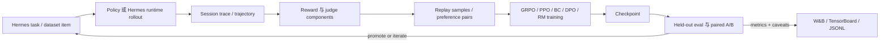

<div align="center">

# hermes-agentic-rl

**面向 Hermes-agent 行为优化、工具调用与 session 驱动改进的原生强化学习框架。**

[English](README.md) | [简体中文](README.zh-CN.md)


</div>

`hermes-agentic-rl` 将 Hermes-agent 的 session 经验转化成一个可度量的
训练闭环：采集轨迹、评判行为、构建 replay 数据、更新可训练 policy 或 reward
model，并通过 held-out benchmark 验证改进。

> 这个仓库是 Hermes-agent 周围的学习层。它面向 Hermes 原生 agentic RL，
> 不是一个通用聊天模型微调封装。

## 目录

- [项目概览](#项目概览)
- [推荐入口](#推荐入口)
- [为什么做这个项目](#为什么做这个项目)
- [可训练对象](#可训练对象)
- [闭环](#闭环)
- [下一步优化](#下一步优化)
- [能力矩阵](#能力矩阵)
- [快速开始](#快速开始)
- [外部子项目](#外部子项目)
- [密钥与环境变量](#密钥与环境变量)
- [训练模式](#训练模式)
- [关键配置](#关键配置)
- [CLI 参考](#cli-参考)
- [架构](#架构)
- [验证](#验证)
- [文档](#文档)

## 项目概览

| 维度 | 本项目提供什么 |
|---|---|
| Agent 目标 | 工具调用、终端命令动作、多轮恢复、协议遵守 |
| 训练路径 | `train-rl` 负责 GRPO/PPO on-policy 训练，`online-cycle` 负责 Hermes replay + worker 训练 |
| 可训练对象 | Tiny/HF policy backend、PPO value head、LoRA adapter、reward-model head、BC/DPO worker |
| 数据来源 | Hugging Face traces、本地 parquet shard、真实 Hermes session log、replay JSONL |
| 评估方式 | held-out grouped trace benchmark、checkpoint ranking、paired A/B 对比 |
| 可观测性 | W&B、TensorBoard、JSONL metrics、live dashboard、结构化 reward components |

## 推荐入口

| 如果你想... | 从这里开始 |
|---|---|
| 先检查仓库和 Hermes 子项目是否接好 | `python -m hermes_agentic_rl.cli.main hermes-preflight` |
| 检查 Atropos 与 Tinker-Atropos 是否接好 | `python -m hermes_agentic_rl.cli.main atropos-preflight` |
| 快速做一个小型 on-policy 训练 | `configs/hermes_reasoning_traces_grpo_smoke.yaml` |
| 在本地 parquet shard 上用 MPS 训练 | `configs/hermes_reasoning_traces_parquet_mps_filtered.yaml` |
| 验证 RL 是否真的带来提升 | `configs/hermes_reasoning_traces_eval_rl.yaml` |
| 按优化方向批量验证 agent 自进化 | `configs/self_evolution_batch.yaml` |
| 跑真实 Hermes、replay、worker 训练和导出闭环 | `configs/hermes_online_cycle.yaml` |

## 为什么做这个项目

`hermes-agent` 是执行层：它负责执行任务、调用工具、连接运行时，并留下 session
trace。`hermes-agentic-rl` 是围绕它的学习层：把这些 trace 转成 rollout、reward、
replay buffer、偏好对、reward model 数据、checkpoint 和 held-out benchmark。

我们的目标不是抽象地提升“聊天模型智商”，而是改善 agent 在具体 Hermes-style
任务中的行为分布：

- 什么时候直接回答，什么时候调用工具；
- 工具调用、终端命令、Hermes 协议格式是否稳定有效；
- 多轮任务里是否能利用工具结果继续推进，而不是中途漂移；
- 高 reward、可完成任务的轨迹概率是否上升；
- 是否能通过 W&B、JSONL、TensorBoard、checkpoint 和 held-out eval 证明改进真实存在。

从 agent 自进化角度看，每次运行都应该是一场受控优化实验：先定义优化方向，再采集
可比较轨迹，训练对应的可学习组件，最后只在 held-out 指标支持时才推进 checkpoint
或 worker。

换言之：Hermes-agent 是执行体，`hermes-agentic-rl` 是让执行体持续被训练、校准、
评估和审计的 RL / 数据 / 指标闭环。

当 backend 是本地、HF-backed、Tiny、LoRA-adapted，或者带有 reward model 时，本项目
会实际更新可训练参数。若 Hermes 使用的是远程 OpenAI-compatible 模型，本项目仍然可
以采集轨迹、评估行为、训练本地 worker 或 reward model、导出 self-evolution 数据，
但不会自动修改远程权重，除非服务方提供训练通道。

## 可训练对象

本项目真正更新的是 policy stack 内部或周边的可训练组件：

- policy backend 本身，例如 `TinyCausalLMBackend` 或 `HFCausalLMBackend`；
- PPO 场景下的 value head（启用 `with_value_head=True` 时）；
- 注入后的 LoRA adapter 参数；
- 偏好学习或 reward model 训练阶段的 reward head；
- 在线 replay 循环里的 BC / DPO worker 权重。

这意味着 `train-rl` 可以实际改进本地或 HF-backed policy，而 `online-cycle` 可以改进
本地 worker 和 reward model。

## 闭环



## 下一步优化

后续增益仍然应该以 benchmark 为中心：

- 强化 held-out benchmark，覆盖工具调用合法性、命令正确率、任务完成率、prompt-context
  保留能力和 paired A/B
  checkpoint 对比；
- 从 tiny 快速验证逐步切到 LoRA 或 HF-backed 可训练策略，让 RL 作用到容量足够的
  agent policy 上；
- 继续优化 reward，重点是 JSON 可解析、tool name 匹配、argument value 相似度、停止
  行为和多轮 credit assignment；
- 持续做数据过滤和 curriculum，让早期目标保持短、可执行、并且与 action space 对齐；
- 在 reward 和 eval 信号稳定后，再推进性能扩展，例如 batched rollout/scoring、
  MPS/GPU profiling 和可选分布式 worker。

最近的 checkpoint sweep、W&B 链接和注意事项记录放在 [实验记录](docs/experiments.md)，
这样 README 可以保持稳定入口的风格。

## 能力矩阵

| 领域 | 入口 | 状态 |
|---|---|---|
| 真实 Hermes runtime | `runtime.integration: hermes` | 可从 `runtime.repo_path`、`HERMES_AGENT_REPO` 或 `subprojects/hermes-agent` 加载。 |
| 本地 RL 快速验证 | `train-rl` | CPU 友好的 Tiny backend，支持 GRPO/PPO 与 W&B/TensorBoard 指标。 |
| 真实数据 RL | `configs/hermes_reasoning_traces_grpo.yaml` | 使用 `lambda/hermes-agent-reasoning-traces`；smoke 配置只用于快速验证。 |
| Held-out RL benchmark | `eval-rl` | 在分组 held-out traces 上对比 baseline 与 checkpoint。 |
| Prompt/context benchmark | `configs/context_benchmark_eval_rl.yaml` | 测量长上下文事实召回、约束保留、工具摘要保留、干扰规避和简洁回答。 |
| 在线 Hermes RL cycle | `configs/hermes_online_cycle.yaml` | Rollout -> sidecar replay -> BC worker -> self-evolution export。 |
| 定向 self-evolution | `self-evolution-batch` | 批量 replay、worker 训练、验证集导出和方向级 summary。 |
| Self-evolution 导出 | `session-eval-export` | 写出 `task_input` / `expected_behavior` JSONL split。 |
| 可观测性 | `metrics:` | JSONL、stdout、TensorBoard、W&B、可选 live dashboard。 |
| 外部子项目 | `subprojects/*` | Hermes-agent、Atropos 与 Tinker-Atropos 的上游 checkout。 |

## 快速开始

```bash
python -m pip install -e '.[rl,data,metrics]'
git submodule update --init subprojects/hermes-agent subprojects/atropos subprojects/tinker-atropos
python -m hermes_agentic_rl.cli.main hermes-preflight
```

预期预检结果形态：

```json
{
  "repo_source": "subproject",
  "missing": []
}
```

`hermes-agent` 默认应位于 `subprojects/hermes-agent`。如需覆盖路径：

```bash
export HERMES_AGENT_REPO=/path/to/hermes-agent
```

## 外部子项目

外部仓库统一以 git submodule 形式放在 `subprojects/` 下，不再作为根目录的一等源代码
vendored 进本仓库。

| 路径 | 上游 | 用途 |
|---|---|---|
| `subprojects/hermes-agent` | `NousResearch/hermes-agent` | 真实 Hermes runtime 与 session replay 集成。 |
| `subprojects/atropos` | `NousResearch/atropos` | 可选 Atropos environment adapter 与兼容性测试。 |
| `subprojects/tinker-atropos` | `NousResearch/tinker-atropos` | 可选 Tinker-Atropos 预检与 trainer 集成检查。 |

clone 或切换分支后执行：

```bash
git submodule update --init subprojects/hermes-agent subprojects/atropos subprojects/tinker-atropos
python -m hermes_agentic_rl.cli.main hermes-preflight
python -m hermes_agentic_rl.cli.main atropos-preflight
```

框架代码会把这些目录视为外部项目。CI 只初始化顶层 submodule，lint、typing、
package 和 docs gate 聚焦本仓库自己的 adapter、trainer、reward、config 和测试。

## 密钥与环境变量

不要把 API key 写进 YAML。Hermes adapter 同时支持单个 `runtime.api_key_env` 和有序的
`runtime.api_key_envs`。

在线循环示例所用的 OpenAI-compatible NewAPI endpoint：

```bash
export NEWAPI_API_KEY='...'
```

示例配置也会回退到 `LKEAP_API_KEY` 和 `OPENAI_API_KEY`。

W&B：

```bash
wandb login
# 或
export WANDB_API_KEY='...'
```

## 训练模式

### 真实数据训练

下面的命令会用 Tiny backend 在公开 Hermes reasoning trace 数据集上运行一个小型
GRPO 快速验证。它足够轻量，但依然基于真实 trace。

```bash
python -m hermes_agentic_rl.cli.main train-rl \
  --config configs/hermes_reasoning_traces_grpo_smoke.yaml \
  --output outputs/hermes_reasoning_traces_real_smoke
```

主要输出：

- `outputs/hermes_reasoning_traces_real_smoke/train_rl_summary.json`
- `outputs/hermes_reasoning_traces_real_smoke/metrics.jsonl`
- `outputs/hermes_reasoning_traces_real_smoke/tb/`
- `outputs/hermes_reasoning_traces_real_smoke/wandb/`

配置会记录 reward 统计、prompt / response token 长度、optimizer step 计数、reward
component 分数以及 gradient / parameter norm。

### 本地 Parquet + MPS

如果本地有 `lambda/hermes-agent-reasoning-traces` parquet shard，可以直接使用 MPS 配置。
loader 会用 `pyarrow` 读取 parquet 行，把 conversation 展开成 assistant-turn
supervised / RL samples，并把 `tools` JSON 载荷还原成 tool schema 数据。

```bash
mkdir -p data/hermes_reasoning_traces
ln -sf /Users/gatilin/Downloads/train.parquet \
  data/hermes_reasoning_traces/train.parquet

export WANDB_API_KEY='...'
PYTORCH_ENABLE_MPS_FALLBACK=1 python -m hermes_agentic_rl.cli.main train-rl \
  --config configs/hermes_reasoning_traces_parquet_mps.yaml \
  --output outputs/hermes_reasoning_traces_parquet_mps_run
```

更强的下一轮 ablation：

```bash
PYTORCH_ENABLE_MPS_FALLBACK=1 python -m hermes_agentic_rl.cli.main train-rl \
  --config configs/hermes_reasoning_traces_parquet_mps_filtered.yaml \
  --output outputs/hermes_reasoning_traces_parquet_mps_filtered_hybrid
```

终端命令 curriculum 阶段：

```bash
PYTORCH_ENABLE_MPS_FALLBACK=1 python -m hermes_agentic_rl.cli.main train-rl \
  --config configs/hermes_reasoning_traces_parquet_mps_terminal_command_stage2.yaml \
  --output outputs/hermes_reasoning_traces_parquet_mps_terminal_command_stage2
```

`assistant_response_adapter: terminal_command_tool_call` 会让 policy 只输出 terminal
command 字符串；reward 和 eval 再把这个字符串包装成 Hermes-compatible terminal tool
call，从而把结构合法性和命令内容学习拆开。

### 如何验证提升

要回答“RL 后模型是否真的提升”，优先看 held-out benchmark，而不是只看训练 reward。
该命令会把同一 `source_trace_id` 下的 turn 放入同一 split，对 baseline 和 checkpoint
使用完全相同的 eval items，并输出 reward、success rate、finished-naturally rate 和
structured tool-call metadata。

```bash
python -m hermes_agentic_rl.cli.main eval-rl \
  --config configs/hermes_reasoning_traces_eval_rl.yaml
```

建议在宣称 checkpoint 提升 agentic behavior 之前，同时查看 held-out reward delta、
paired A/B、`tool_call_parse_ok`、`tool_name_match` 和 argument-overlap 等指标。

`eval-rl` 会写出 `promotion.md` 和 `capability_report.md`。后者会把底层指标聚合成
更贴近 Hermes Agent 的能力维度，例如任务成功、工具调用可靠性、交互控制和
self-evolution 信号。这样我们下一轮优化时，不只看单个 reward，而是能判断到底
是哪类 agent 能力在提升。自动化流程可以使用 `eval-gate`；当 promotion gate
建议 `hold` 时，它会返回退出码 `3`。

命令动作阶段的评估：

```bash
python -m hermes_agentic_rl.cli.main eval-rl \
  --config configs/hermes_reasoning_traces_eval_rl_terminal_command_stage2.yaml
```

### 在线 Hermes 循环

`online-cycle` 是端到端在线路径：

1. 在任务 prompt 上运行真实 Hermes。
2. 使用 session sidecar 写出原始 session trace 和带方向标注的 replay samples。
3. 从 replay 训练本地 worker，可选 `bc`、`dpo` 或 `rm` worker 配置。
4. 把同一批 trace 导出为 self-evolution dataset。
5. 将 worker metrics 记录到 JSONL 和 W&B。

```bash
export NEWAPI_API_KEY='...'

python -m hermes_agentic_rl.cli.main online-cycle \
  --config configs/hermes_online_cycle.yaml \
  --once \
  --limit 1
```

主要输出：

- `outputs/hermes_online_cycle/sessions.jsonl`
- `outputs/hermes_online_cycle/replay.jsonl`
- `outputs/hermes_online_cycle/policy.pt`
- `outputs/hermes_online_cycle/worker_state.json`
- `outputs/hermes_online_cycle/worker_metrics.jsonl`
- `outputs/hermes_online_cycle/self_evolution_dataset/`

Replay 记录会包含 `metadata.replay_mining`，用于标注 capability axes、挖掘原因、
推荐用途以及 Skill-candidate 信号。对应的 quality report 会聚合这些标签，让我们
可以按优化方向筛选 replay，而不是把所有 session turn 当成同一种训练信号。

### Self-Evolution 导出

把已有 Hermes session trace 转换为 evaluation / self-evolution 数据：

```bash
python -m hermes_agentic_rl.cli.main session-eval-export \
  --config configs/session_eval_export_hermes.yaml
```

输出包括：

- `train.jsonl`
- `val.jsonl`
- `holdout.jsonl`
- `manifest.json`

每条记录包含 `task_input`、`expected_behavior`、difficulty / category metadata、reward
以及源 session 标识。

### 批量 Self-Evolution 验证训练

如果希望按照明确方向优化 agent，可以运行批量 self-evolution pipeline。它会对同一批
Hermes session trace 按方向执行 replay、训练本地 worker，并导出对应方向的
self-evolution dataset。

```bash
python -m hermes_agentic_rl.cli.main self-evolution-batch \
  --config configs/self_evolution_batch.yaml
```

主要输出：

- `outputs/hermes_self_evolution_batch/batch_summary.json`
- `outputs/hermes_self_evolution_batch/<direction>/replay.jsonl`
- `outputs/hermes_self_evolution_batch/<direction>/policy.pt`
- `outputs/hermes_self_evolution_batch/<direction>/worker_state.json`
- `outputs/hermes_self_evolution_batch/<direction>/self_evolution_dataset/`

适合用来同时比较多个优化方向，例如工具调用稳定性、失败恢复能力和任务完成质量。
batch summary 也会输出 `mined_replay_axes` 和 `skill_candidates`，帮助判断下一轮
应该继续训练权重、采集更多 session，还是导出候选 Skills。

### Skill Candidate 导出

Replay mining 现在可以进一步沉淀为具体的 agent 能力资产。`skill-export` 会读取
replay JSONL，筛选 `metadata.replay_mining.skill_candidate` 标记的样本，并导出
可人工 review 的 Skill 候选和验证样本。

```bash
python -m hermes_agentic_rl.cli.main skill-export \
  --config configs/skill_export.yaml
```

每个候选目录包含 `SKILL.md`、`manifest.json` 和 `validation.jsonl`。新的 replay
记录还会保留紧凑的 `metadata.source_turn` 证据，让生成的 Skill 草案能够引用用户任务、
assistant 行为、反馈、reward 和 capability axes。

## 关键配置

| 配置 | 用途 |
|---|---|
| `configs/hermes_reasoning_traces_grpo_smoke.yaml` | 真实 HF 数据集 GRPO 快速验证，带 W&B/TensorBoard metrics。 |
| `configs/hermes_reasoning_traces_grpo.yaml` | 更大的真实数据 GRPO 运行。 |
| `configs/hermes_reasoning_traces_parquet_mps.yaml` | 本地 parquet reasoning trace，在 Apple MPS 上训练。 |
| `configs/hermes_reasoning_traces_parquet_mps_filtered.yaml` | 更短 tool-call target 的过滤版 MPS run。 |
| `configs/hermes_reasoning_traces_parquet_mps_terminal_curriculum.yaml` | terminal-command curriculum 阶段，带固定 JSON scaffold。 |
| `configs/hermes_reasoning_traces_parquet_mps_terminal_command_stage2.yaml` | stage-2 terminal command action-space 训练。 |
| `configs/hermes_reasoning_traces_eval_rl.yaml` | held-out benchmark，对比 baseline 与 RL checkpoint。 |
| `configs/hermes_reasoning_traces_eval_rl_terminal_command_stage2.yaml` | stage-2 command-action checkpoint 的 held-out benchmark。 |
| `configs/context_benchmark_eval_rl.yaml` | prompt-context benchmark，覆盖事实召回、约束保留和干扰规避。 |
| `configs/self_evolution_batch.yaml` | 按方向批量运行 self-evolution replay、worker 训练和导出。 |
| `configs/skill_export.yaml` | 导出 replay mining 得到的 Skill 候选和验证样本。 |
| `configs/hermes_online_cycle.yaml` | 真实 Hermes online rollout、replay worker 和 self-evolution export。 |
| `configs/hermes_runtime_sidecar.yaml` | runtime sidecar 示例，用于 session / replay capture。 |
| `configs/session_train_worker.yaml` | 基于 replay JSONL 的 BC worker。 |
| `configs/session_dpo_worker.yaml` | 基于 scored replay pair 的 DPO worker。 |
| `configs/session_rm_worker.yaml` | 基于 scored replay pair 的 reward-model worker。 |

## CLI 参考

```bash
python -m hermes_agentic_rl.cli.main hermes-preflight
python -m hermes_agentic_rl.cli.main rollout --config <config> --output outputs/trajectory.json
python -m hermes_agentic_rl.cli.main train --config <config>
python -m hermes_agentic_rl.cli.main train-rl --config <config> --output <dir>
python -m hermes_agentic_rl.cli.main eval-rl --config <config>
python -m hermes_agentic_rl.cli.main self-evolution-batch --config <config>
python -m hermes_agentic_rl.cli.main online-cycle --config <config> --once --limit 1
python -m hermes_agentic_rl.cli.main session-replay --config <config>
python -m hermes_agentic_rl.cli.main session-train-worker --config <config> --once
python -m hermes_agentic_rl.cli.main session-eval-export --config <config>
python -m hermes_agentic_rl.cli.main skill-export --config <config>
```

## 架构

```text
hermes_agentic_rl/
  runtime/       Hermes 和 fake runtime adapters
  framework/     EnvTrainingPipeline 和 SessionTrainingPipeline
  collectors/    Session sidecar、replay export、quality filters、replay mining、Skill export
  envs/          Echo、simulated tool、curriculum、Hermes reasoning traces
  trainers/      GRPO/PPO on-policy trainers
  eval/          Held-out eval、leaderboard、paired A/B comparison
  offline/       BC、DPO、reward-model training
  rewards/       Outcome、tool-call、filesystem、feedback、RM components
  monitor/       JSONL、TensorBoard、W&B、dashboard writers
  cli/           Rollout、train、train-rl、eval-rl、eval-gate、self-evolution-batch、online-cycle、replay workers、skill-export
```

数据流：

```text
Hermes rollout
  -> session_sidecar
  -> sessions.jsonl + replay.jsonl
  -> session_train_worker
  -> policy / RM checkpoint
  -> session_eval_export
  -> self_evolution_dataset
```

## 验证

仓库把 lint、类型检查、coverage、docs 和 dependency audit 都视为交付的一部分：

```bash
python -m ruff check hermes_agentic_rl tests scripts/check_real_hermes.py
python -m mypy --follow-imports=skip hermes_agentic_rl
python -m pytest tests -q --cov=hermes_agentic_rl --cov-report=term-missing --cov-report=xml
sphinx-build -W --keep-going -b html docs/sphinx docs/sphinx/_build/html
uv pip compile --universal pyproject.toml --extra dev --extra docs --output-file requirements-lock.txt
pip-audit -r requirements-lock.txt
```

GitHub Actions 会在 Python 3.11 和 3.12 上运行 lint、coverage tests、docs build 和
dependency audit。实时训练 / eval 验证快照记录在 [实验记录](docs/experiments.md)。

## 文档

- [Hermes 原生训练框架](docs/hermes-native-training-framework.md)
- [实验记录](docs/experiments.md)
- [Self-evolution export](docs/self-evolution-export.md)
- [Real Hermes check](docs/real-hermes-check.md)
- [Configuration reference](docs/configuration.md)
- [ADRs](docs/adr/)
- [Contributor guide](CONTRIBUTING.md)
- [Sphinx docs](docs/sphinx/)
